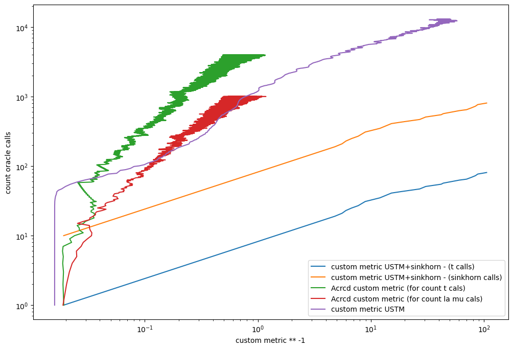

## Имплементации экспериментов для статьи: "Об ускоренных покомпонентных методах поиска равновесий в двухстадийной модели равновесного распределения транспортных потоков"

В репозитории имплементирована транспортная двухстадийная модель (файл transport_problem.py - class DualOracle) и несколько 
  различных алгоритмов оптимизации:
- USTM - универсальный метод подобных треугольников (Universal Method of Similar Triangles): градиентный шаг сразу по всем переменным.
- USTM-Sinkhorn - градиентный шаг по t и решение задачи по остальным переменным с помощью алгоритма Синхорна
- ACRCD* - ускоренный покомпонетный метод (Accelerated by Coupling
Ran- domized Coordinate Descent – ACRCD) - оптимизация происходит по блокам переменных - 
вероятность выбора блока зависит от (не)гладкости функции по
данному блоку.


Репозиторий содержит результаты вычислительных экспериментов по
  качеству сходимости перечисленных методов на реальных графах. Для тестирования использовались графы из [репозитория](https://github.com/bstabler/TransportationNetworks).
  Для того чтобы оценивать сходимость методов было выбрано два критерия: зазор двойственности
  (разность между значением прямой и двойственной функции) и норма градиента по переменным λ и μ.
  Итоговая метрика объединяет оба критерия:
  ```python
    # results: AlgoResults from algorithms
    x = results.history_count_calls
    dual_gap = results.history_dual_gap
    dual_gap_clipped = np.maximum(0, dual_gap)
    la_mu_end_norm = np.linalg.norm(np.hstack([oracle_stacker.optim_params.la, oracle_stacker.optim_params.mu]))               
    metric = 2 * np.array(results.history_la_mu_grad_norm) * la_mu_end_norm + dual_gap_clipped

    # (x, metric) - result plot
  ```

  Метрики фиксировались относительно текущего кол-ва оракульных вызовов.

Использование перечисленных алгоритмов на реальном графе и результаты экспериментов находятся в файлах:
- [test_USTM.ipynb](test_USTM.ipynb)
- [test_USTM_Sinkhorn.ipynb](test_USTM.ipynb)
- [test_ACRCD_transport](test_ACRCD_transport(1).ipynb)

Реализации самих методов и интерфейсов для работы с транспортной задачей:
- [USTM](subgd.py)
- [USTM_Sinkhorn](TODO)
- [ACRCD*](acrcd.py)

Используемые графы:
- SiouxFalls
- Anaheim
- Chicago
- Berlin

### Визуализация сравнения алгоритмов на графе Anaheim:



eps_abs=10<sup>-2</sup> 
crit_eps_abs=10<sup>-2</sup>
условием остановки было достижение данных констант или максимального кол-во итераций  