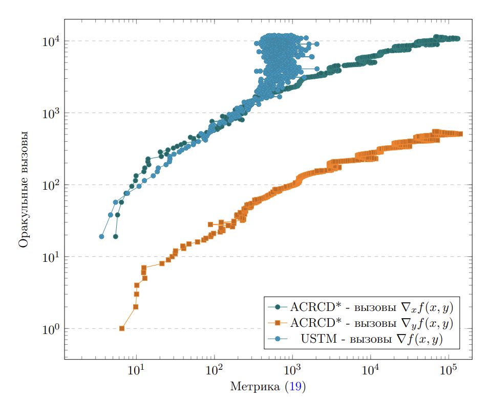
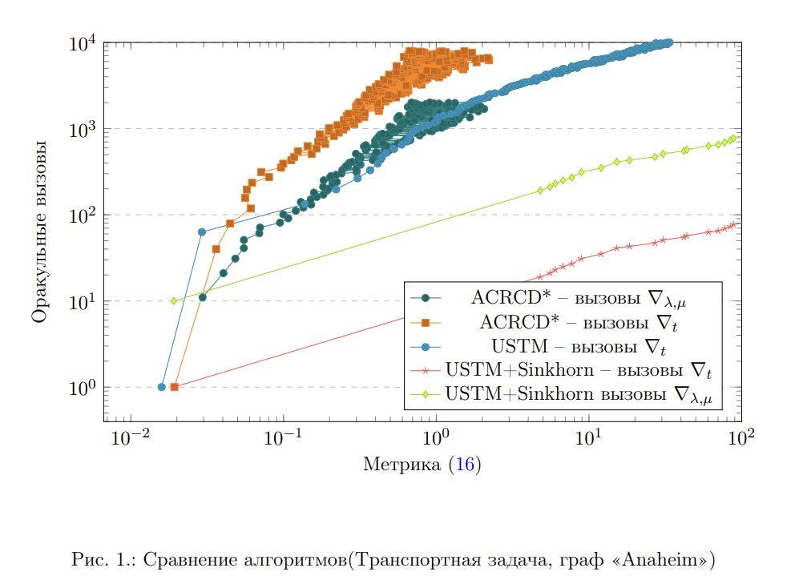

## Имплементации экспериментов для статьи: "Об ускоренных покомпонентных методах поиска равновесий в двухстадийной модели равновесного распределения транспортных потоков"

В репозитории имплементирована транспортная двухстадийная модель (файл transport_problem.py - class DualOracle) и несколько 
  различных алгоритмов оптимизации:
- USTM - универсальный метод подобных треугольников (Universal Method of Similar Triangles): градиентный шаг сразу по всем переменным.
- USTM-Sinkhorn - градиентный шаг по t и решение задачи по остальным переменным с помощью алгоритма Синхорна
- ACRCD* - ускоренный покомпонетный метод (Accelerated by Coupling
Ran- domized Coordinate Descent – ACRCD) - оптимизация происходит по блокам переменных - 
вероятность выбора блока зависит от (не)гладкости функции по
данному блоку.

P. S. Для метода ACRCD* убрана адаптивность  по (не)гладкости 
из-за проблем со сходимостью - запуски производились с подобранными константами гладкости.

Репозиторий содержит результаты вычислительных экспериментов по
  качеству сходимости перечисленных методов на реальных графах. Для тестирования использовались графы из [репозитория](https://github.com/bstabler/TransportationNetworks).
  Для того чтобы оценивать сходимость методов было выбрано два критерия: зазор двойственности
  (разность между значением прямой и двойственной функции) и норма градиента по переменным λ и μ.
  Итоговая метрика объединяет оба критерия:
  ```python
    # results: AlgoResults from algorithms
    x = results.history_count_calls
    dual_gap = results.history_dual_gap
    dual_gap_clipped = np.maximum(0, dual_gap)
    la_mu_end_norm = np.linalg.norm(np.hstack([oracle_stacker.optim_params.la, oracle_stacker.optim_params.mu]))               
    metric = 2 * np.array(results.history_la_mu_grad_norm) * la_mu_end_norm + dual_gap_clipped

    # (x, metric) - result plot
  ```

  Метрики фиксировались относительно текущего кол-ва оракульных вызовов.
  Графики всех экспериментов можно найти в [папке](paper_plots_sources).

### Эксперименты
<b> Создание среды</b>

```
>>> conda create --name transport_env -c conda-forge graph-tool
>>> conda activate transport_env
>>> pip install -r requirements.txt
>>> conda install ipykernel
>>> python -m ipykernel install --user --name transport_env --display-name "transport_env"
```

<b>Запуск и сравнение всех алгоритмов:
[comparison of all algorithms](testing_all_algos.ipynb)
</b>

Тестирование покомпонетных методов на тестовой задаче:
- [TestProblem](test_problem_algos.ipynb)

Реализации самих методов и интерфейсов для работы с транспортной задачей:
- [USTM](subgd.py)
- [USTM_Sinkhorn](sinkhorn_appendix.py)
- [ACRCD*](acrcd.py)

Ноутбуки с использование каждого из перечисленных алгоритмов в отдельности (неактуально)
- [USTM](test_USTM.ipynb)
- [USTM_Sinkhorn](test_USTM.ipynb)
- [ACRCD*](test_acrcd.ipynb)

<b>Тестовая задача</b>

Для проверки эффективности покомпонентного метода на 
описанном в статье классе min-min задач сначала была введена
"искусственная" тестовая задача
оптимизации, зависящая от двух блоков переменных:
[TestProblem](test_sampler.py). На ней провелось сравнение алгоиртмов
USTM и ACRCD*. 

Результаты экспериментов показали что метод эффективен на данной задаче 
достичь одного и того же значения метрики можно за значительно меньшее 
кол-во обращений к "дорогому" оракулу.
Это означает что с помощью данного метода для описанных задач 
достигается общее ускорение по времени работы алгоритма. 



После этого было проведено тестирование на транспортной задаче. Используемые графы:
- SiouxFalls
- Anaheim
- Chicago
- Berlin


### Транспортная задача
Описанные алгоритмы было запущены на нескольких графах, получены схожие результаты

<b>Визуализация сравнения алгоритмов на графе Anaheim</b>


График демонстрирует, что применительно к задаче поиска равновесий в двухстадийной модели,
из-за того, что оракул по негладкому блоку переменных сильно
дороже оракула по гладкому блоку, получается, что эффект от 
расщепления оракульных сложностей проявляется не так ярко, 
как потенциально мог бы проявляться в целом на рассматриваемом классе min-min задач.
Поэтому ключевую роль играют именно численные эксперименты,
которые показали, что алгоритм ACRCD, хоть и является "физичным",
однако работает хуже, чем обычный USTM и USTM-Sinkhorn! 
